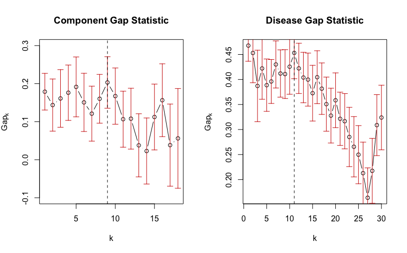

# Hierarchical_Clustering_VBM_ICA

The repository shows the code used for HCA analysis on the disease loading matrix. It also shows the code used for silhouette length and gap statistic plots. For more information about the results of this analysis, see manuscript, "BrainMap VBM: An Environment for Structural Meta-analysis" by Vanasse et al.

Published: 2 May 2018 (https://doi.org/10.1002/hbm.24078)

## Figures

